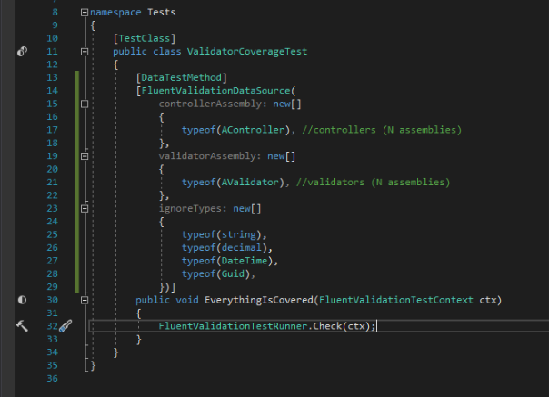
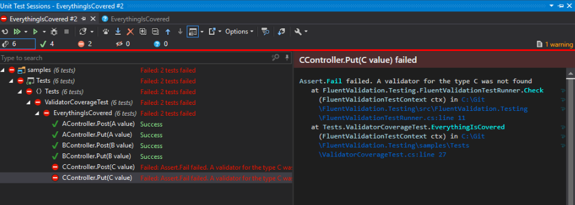
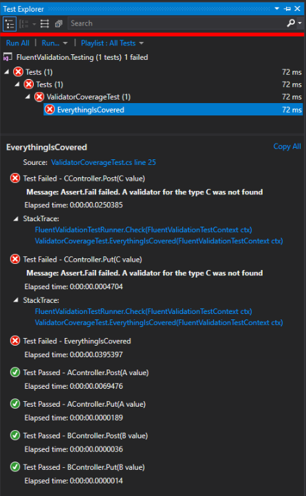

# Fluent Validation coverage test

This is a super simple tool to check that all API methods are covered with validators.  
It searches for all **controllers** -> **action methods** -> **parameters** and checks that there is at least one class inherited from the `AbstractValidator<T>` where T is the api parameter type.

## The unit test
Create a unit test and decorate it appropriately.  

## The Resharper test runner
One unit test is generated for each parameter.  
You can see the controller name, action name, and the parameter type + value  

## The Visual Studio test runner
The same is in the Visual Studio test explorer.  

